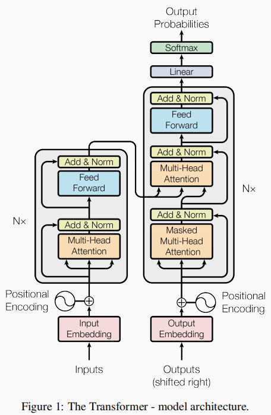
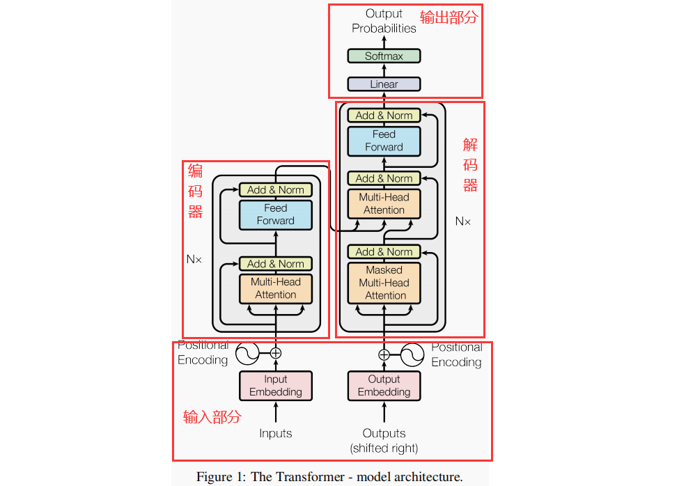
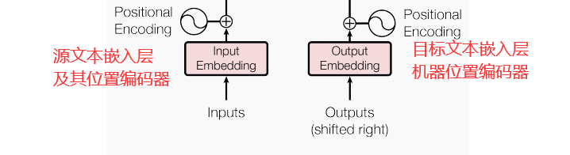
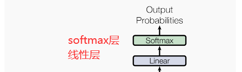
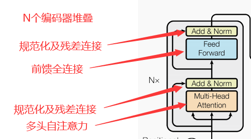
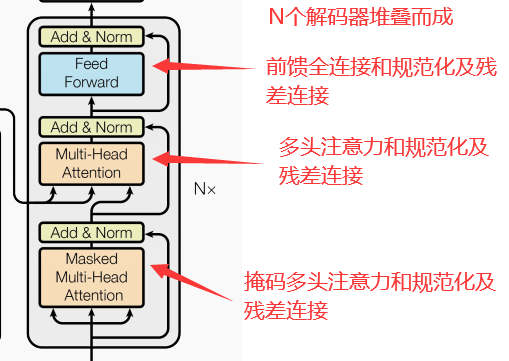

# transforms
解读transforms和代码实现

- transforms总架构分为四个部分

  - 输入部分

  - 输出部分

  - 编码器

  - 解码器

    

- 输入部分

- 输出部分

  

  添加线性层将上一步的输出向量（例如，词嵌入）映射到一个新的向量空间，添加softmax将线性层的输出转换成概率分布，提取出概率最大的值。

  总的来说，Linear层负责将输入数据映射到新的特征空间，而Softmax层则将这个映射转换成概率分布，使得模型可以以概率的形式表达其预测结果。

- 编码器

- 解码器

